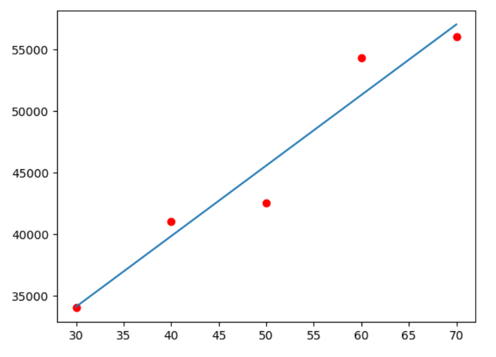

# Linear-Regression-Analysis-Single-variable

This project demonstrates a **Simple Linear Regression** model to predict the total number of views a YouTube channel might receive based on the number of videos uploaded.

## 📊 Project Overview
The goal is to understand the correlation between video quantity and audience reach. This is a fundamental Machine Learning project focusing on predictive modeling.

## 🛠️ Tech Stack
* **Language:** Python
* **Libraries:** * `Pandas` (Data manipulation)
  * `Matplotlib` (Data visualization)
  * `Scikit-learn` (Machine Learning model)

## 📁 Dataset
The dataset (`Book1.csv`) contains:
* **Videos:** Number of videos uploaded.
* **Views:** Total views received.

## 🚀 How to Run
1. Clone this repository.
2. Ensure you have Jupyter Notebook or Anaconda installed.
3. Run `Single variable.ipynb` to see the model training and visualization.

4. ## 📈 Model Visualization

